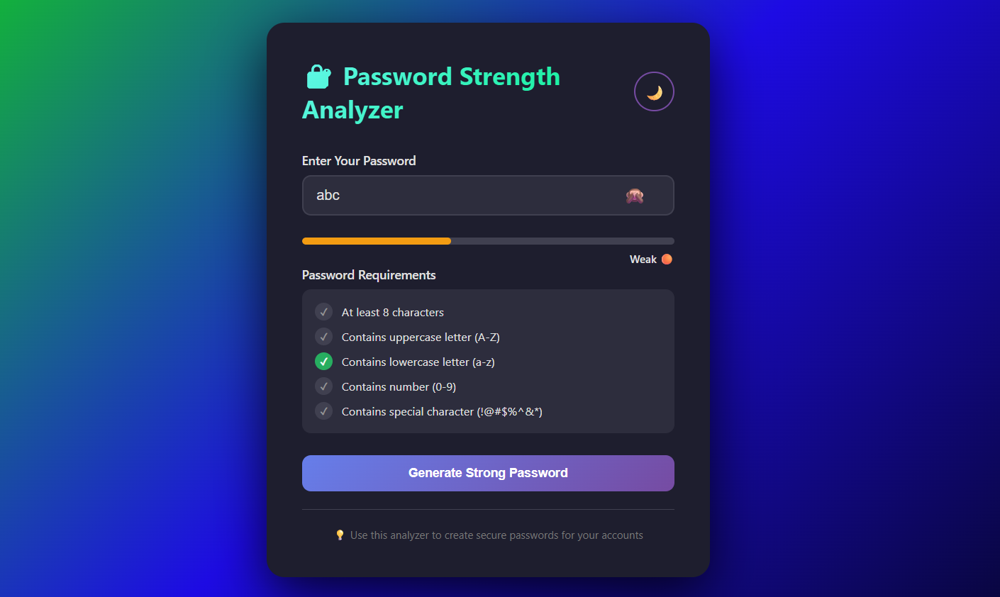
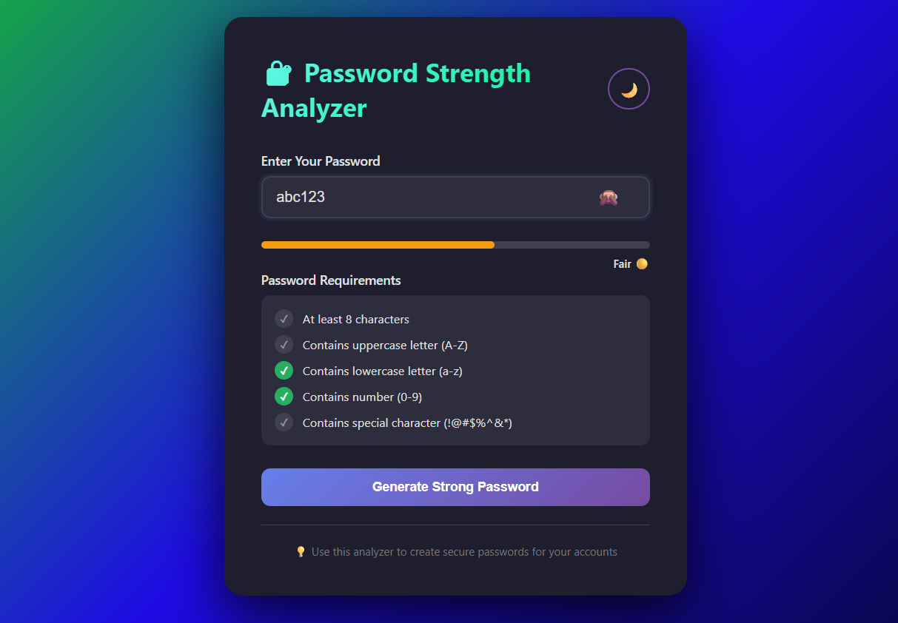
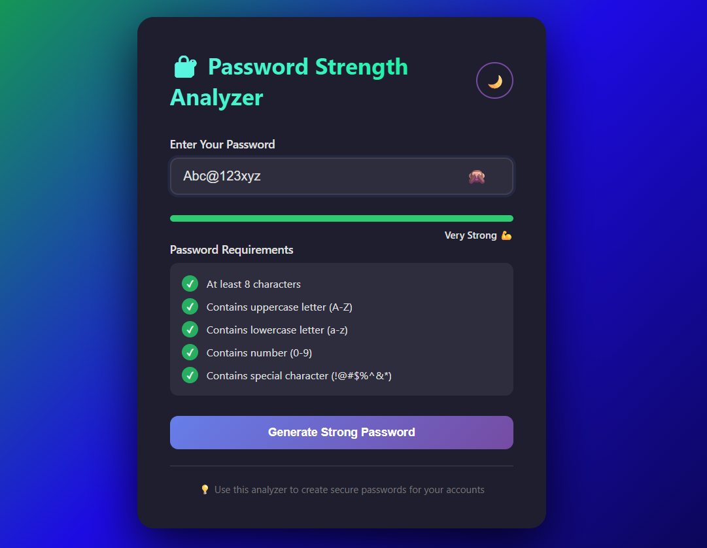

# 🔐 Password Strength Analyzer

## Project Description

The **Password Strength Analyzer** is a real-time password validation tool that helps users create stronger, more secure passwords. As you type, the tool instantly evaluates your password against multiple security criteria and provides visual feedback on its strength level. This project demonstrates the practical application of form validation and user experience design principles.

## Features

✅ **Real-Time Analysis** - Get instant feedback as you type your password  
✅ **Strength Levels** - Visual indication of password strength (Weak, Medium, Strong)  
✅ **Comprehensive Checks** - Validates:
   - Password length (minimum 8 characters recommended)
   - Uppercase letters (A-Z)
   - Lowercase letters (a-z)
   - Numbers (0-9)
   - Special characters (!@#$%^&* etc.)

✅ **Color-Coded Indicators** - Easy-to-understand visual feedback with color bars  
✅ **User-Friendly Interface** - Clean, intuitive design suitable for all users  
✅ **Lightweight** - No external dependencies, pure vanilla JavaScript  

## Technologies Used

- **HTML5** - Semantic markup for structure
- **CSS3** - Styling and responsive design
- **JavaScript (Vanilla)** - Password analysis logic and real-time validation

## How It Works

1. **Enter Your Password** - Type your desired password in the input field
2. **Real-Time Analysis** - The tool analyzes your password against multiple criteria
3. **Receive Feedback** - See your password strength level and which criteria are met
4. **Improve Your Password** - Follow the suggestions to strengthen your password

### Strength Calculation Logic

The analyzer evaluates your password based on:

| Criteria | Points |
|----------|--------|
| Length ≥ 8 characters | +1 |
| Contains uppercase letters | +1 |
| Contains lowercase letters | +1 |
| Contains numbers | +1 |
| Contains special characters | +1 |

**Strength Levels:**
- **Weak** (0-2 criteria met) - Red indicator
- **Medium** (3 criteria met) - Yellow indicator
- **Strong** (4-5 criteria met) - Green indicator

## Installation / How to Run

### Option 1: Direct File Opening
1. Download or clone this repository
2. Navigate to the project folder
3. Open `password-strength-analyzer.html` in your web browser (Chrome, Firefox, Safari, Edge, etc.)
4. Start analyzing your password strength!

### Option 2: Using a Local Server (Recommended)
```bash
# Using Python 3
python -m http.server 8000

# Or using Python 2
python -m SimpleHTTPServer 8000

# Or using Node.js (if installed)
npx http-server
```
Then open `http://localhost:8000` in your browser.

### Option 3: Using VS Code Live Server
1. Install the Live Server extension in VS Code
2. Right-click on `password-strength-analyzer.html`
3. Select "Open with Live Server"

## Project Structure

```
Password-Analyzer/
├── password-strength-analyzer.html    # Main HTML file with embedded CSS and JavaScript
├── screenshots/                        # Folder containing demo screenshots
│   ├── weak-password.png
│   ├── medium-password.png
│   └── strong-password.png
└── README.md                          # Project documentation (this file)
```

## Screenshots

### Weak Password

*Example of password with weak strength indicator*

### Medium Password

*Example of password with medium strength indicator*

### Strong Password

*Example of password with strong strength indicator*

## Future Improvements

📋 **Planned Enhancements:**
- [ ] Add password strength meter with percentage indicator
- [ ] Generate random secure password suggestions
- [ ] Add password visibility toggle (show/hide)
- [ ] Include keyboard shortcut support
- [ ] Add dark mode theme
- [ ] Multi-language support
- [ ] Local password strength history tracking
- [ ] Export password strength report as PDF
- [ ] Integration with popular password managers
- [ ] Accessibility improvements (WCAG 2.1 compliance)

## Usage Example

```html
<!-- Simple integration example -->
<input type="password" id="passwordInput" placeholder="Enter your password">
<div id="strengthIndicator"></div>
```

Simply open the HTML file and start using it immediately. No installation or setup required!

## Browser Compatibility

✅ Chrome (latest)  
✅ Firefox (latest)  
✅ Safari (latest)  
✅ Edge (latest)  
✅ Opera (latest)  

## Learning Outcomes

This project demonstrates:
- Real-time DOM manipulation with JavaScript
- Event handling and input validation
- Conditional logic and string methods
- CSS styling and responsive design
- User experience best practices

## Author

**Your Name**  
- GitHub: [@princenaware](https://github.com/princenaware)
- Email: princenaware516@gmail.com


---


## Support

If you encounter any issues or have suggestions for improvements, please feel free to:
- Open an issue on GitHub
- Send an email to the author
- Submit a pull request with your improvements

---

**Last Updated:** February 13, 2026

**Happy Coding!** 🚀
